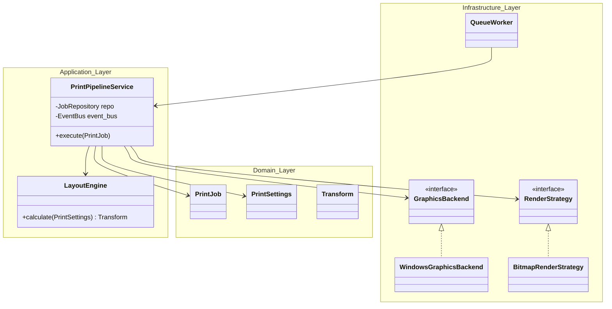

# Bản Thiết Kế Chi Tiết: Refactor Kiến Trúc In Ấn (Chuẩn DDD & Pipeline-in.md)

## User Review Required

> [!IMPORTANT]
> - Trả lời câu hỏi của bạn về `infrastructure/renderer`, tôi đã bổ sung chi tiết vào **Mục 4 (Bước 3)**.
> - Nếu bạn đã sẵn sàng đập bỏ cấu trúc cũ và xây dựng lại theo bản thiết kế hoàn hảo này, hãy gõ lệnh **Approve**!

## 1. Phân tích: Tại sao không gộp vào 1 Folder? Chuyển lên Application thì sao?

**Câu 1: "Tại sao không viết chung vào 1 folder?"**
Hoàn toàn CÓ THỂ gộp chung! Nhưng trong `docs/pipeline-in.md`, bạn đang muốn biến module in ấn thành một hệ thống cốt lõi có khả năng mở rộng. Khi bạn tách ra làm các folder `pdfium` và `graphics` riêng biệt:
- Bạn thể hiện rõ `pdfium` là một công nghệ (Technology), `graphics` là môi trường HĐH (Environment).
*(Tuy nhiên, nếu bạn muốn gọn gàng, tôi hoàn toàn có thể gom chúng vào chung 1 folder `infrastructure/pipeline/` cho bạn. Bạn chỉ cần yêu cầu!).*

**Câu 2: "Nếu chuyển lên layer Application thì sẽ như thế nào?"**
Đây là một **"đại kỵ"** trong kiến trúc DDD! Layer `Application` sinh ra để điều khiển "Luồng Nghiệp Vụ" và phải hoàn toàn "mù" về công nghệ.
Nếu bạn mang code của PDFium và Win32 API đặt vào thư mục `application/`:
1. **Ô nhiễm (Pollution):** Tầng Application sẽ bị dính chặt (coupled) vào hệ điều hành Windows.
2. **Không thể Unit Test:** Bằng cách đẩy chúng xuống `Infrastructure`, tầng Application của bạn trở thành Pure Rust, có thể chạy Unit Test siêu tốc trên cả máy Macbook hay Linux.

---

## 2. Sự ảnh hưởng đến `handlers`, `dto` và `use_cases`
**100% KHÔNG BỊ ẢNH HƯỞNG (GIỮ NGUYÊN HOÀN TOÀN)!**
1. **`application/dto`**: API request của frontend không cần thay đổi. Các DTOs giữ nguyên.
2. **`application/use_cases`**: `create_print_job` vẫn làm đúng nhiệm vụ: Khởi tạo `PrintJob::new(...)` và lưu vào `JobRepository`. Giữ nguyên!
3. **`application/handlers`**: `push_to_queue_handler` vẫn lắng nghe event và đẩy Job ID vào `QueueWorker`.

---

## 3. Sơ đồ Kiến trúc Tổng thể (DDD)


## 4. Chi tiết thuật toán từng bước triển khai

### Bước 1: Khởi tạo Domain Layer (Nghiệp vụ cốt lõi)

**1. `domain/printer` sẽ bị XOÁ BỎ hoàn toàn!** (Code thừa do load trực tiếp từ OS).

**2. `domain/document` và `domain/print_job`**: Giữ nguyên hoàn toàn Aggregate và Events, chỉ xoá các đoạn Unit Test.

**3. `src-tauri/src/domain/settings/mod.rs`**:
```rust
pub enum ColorMode { RGB, ARGB, BGR, GRAY, BINARY }
pub enum Orientation { Portrait, Landscape }

pub struct PrintSettings {
    pub printer_name: String,
    pub paper_size: String,
    pub paper_width: Option<f32>,
    pub paper_height: Option<f32>,
    pub orientation: Orientation,
    pub color_mode: ColorMode,
    
    // Margins
    pub margin_top: f32,
    pub margin_left: f32,
    pub margin_right: f32,
    pub margin_bottom: f32,
    
    // Buffer & Image configs
    pub print_as_image: bool,
    pub enable_buffer: bool,
    pub buffer_size: Option<u32>, // Kích thước buffer tính bằng KB
}
```

**4. `src-tauri/src/domain/layout/mod.rs`**:
```rust
pub struct Transform {
    pub scale_x: f32,
    pub scale_y: f32,
    pub translate_x: f32,
    pub translate_y: f32,
}
```

### Bước 2: Khởi tạo Application Layer (Điều phối Use Cases)

**1. `src-tauri/src/application/services/layout_engine.rs`**:
```rust
pub struct LayoutEngine;
impl LayoutEngine {
    pub fn calculate(settings: &PrintSettings, pdf_width: f32, pdf_height: f32) -> Transform {
        let printable_width = settings.paper_width.unwrap_or(pdf_width) - settings.margin_left - settings.margin_right;
        let printable_height = settings.paper_height.unwrap_or(pdf_height) - settings.margin_top - settings.margin_bottom;
        
        let scale_x = printable_width / pdf_width;
        let scale_y = printable_height / pdf_height;
        let scale = f32::min(scale_x, scale_y);
        
        Transform {
            scale_x: scale,
            scale_y: scale,
            translate_x: settings.margin_left,
            translate_y: settings.margin_top,
        }
    }
}
```

**2. `src-tauri/src/application/services/print_pipeline.rs`**:
*(Luồng xử lý 6 bước sẽ được viết chi tiết ở Phần 5).*

### Bước 3: Hiện thực Infrastructure Layer (Cổng giao tiếp)

**1. `src-tauri/src/infrastructure/graphics/windows.rs`**:
```rust
pub struct WindowsGraphicsBackend { hdc: Option<windef::HDC> }
impl GraphicsBackend for WindowsGraphicsBackend {
    fn begin_document(&mut self, printer_name: &str, doc_name: &str) -> Result<(), String> {
        // Gọi CreateDCW, khởi tạo DOCINFOW, gọi StartDocW
    }
    
    fn draw_bitmap(&mut self, data: &[u8], width: u32, height: u32, bpp: u16) {
        // Gọi StartPage, cấu hình BITMAPINFOHEADER, gọi StretchDIBits, gọi EndPage
    }
    
    fn end_document(&mut self) {
        // Gọi EndDoc và DeleteDC
    }
}
```

**2. Số phận của thư mục `infrastructure/renderer` hiện tại**:
Hiện tại bạn đang có `pdfium_renderer.rs` và `strategy_selector.rs`. Trong đợt Refactor này, tôi sẽ **ĐỔI TÊN** thư mục `renderer` thành `infrastructure/pdfium` (vì toàn bộ render logic của bạn đang dựa trên PDFium). 
File `pdfium_renderer.rs` cũ sẽ được lột xác thành `BitmapRenderStrategy` mới với khả năng **Fallback 1-bit BINARY** (giải quyết triệt để lỗi nặng bộ nhớ Spooler). 
Còn `DirectPdfRenderStrategy` sẽ được dọn dẹp để chuẩn bị cho tương lai. Các file thừa và các cụm Unit test dài dòng bên trong cũng sẽ bị xoá đi cho gọn.
```rust
pub struct BitmapRenderStrategy;
impl RenderStrategy for BitmapRenderStrategy {
    fn render(&self, pdf_path: &str, transform: &Transform, settings: &PrintSettings, backend: &mut dyn GraphicsBackend) {
        // 1. Ép config về Binary (1-bit) nếu `print_as_image == false`.
        // 2. Tính kích thước Pixel theo DPI.
        // 3. Render mảng byte từ thư viện Pdfium.
        // 4. Bơm mảng byte xuống `backend.draw_bitmap()`.
    }
}
```

### Bước 4: Refactor QueueWorker & Dọn dẹp

**`src-tauri/src/infrastructure/queue/queue_worker.rs`**:
```rust
fn process_job(&self, job: PrintJob) -> Result<(), String> {
    let pipeline = PrintPipelineService::new(
        self.downloader.clone(),
        self.job_repo.clone(), 
        self.event_store.clone(), 
        self.event_bus.clone()
    );
    pipeline.execute(job)?;
    Ok(())
}
```

## 5. Luồng thực thi chi tiết bên trong `PrintPipelineService::execute`

```rust
pub fn execute(&self, mut job: PrintJob) -> Result<(), String> {
    // BƯỚC 1: DOWNLOAD
    let pdf_path = self.downloader.download(job.pdf_url())?;
    job.mark_downloaded();
    self.persist_and_publish(&job, PrintJobDownloaded);

    // BƯỚC 2: CẤU HÌNH
    let settings = JsonSettingsManager::get_global_settings();

    // BƯỚC 3: LAYOUT
    let (pdf_w, pdf_h) = get_pdf_size(&pdf_path); 
    let transform = LayoutEngine::calculate(&settings, pdf_w, pdf_h);

    // BƯỚC 4: CHUẨN BỊ
    job.mark_submitted();
    self.persist_and_publish(&job, PrintJobSubmittedToQueue);

    // BƯỚC 5: IN ẤN
    job.mark_printing();
    self.persist_and_publish(&job, PrintJobPrinting);
    
    let mut backend = WindowsGraphicsBackend::new();
    backend.begin_document(&settings.printer_name, "Sapo Order")?;
    
    let strategy = BitmapRenderStrategy::new();
    strategy.render(&pdf_path, &transform, &settings, &mut backend);
    
    backend.end_document();

    // BƯỚC 6: HOÀN THÀNH
    job.mark_completed();
    self.persist_and_publish(&job, PrintJobCompleted);
    Ok(())
}
```
