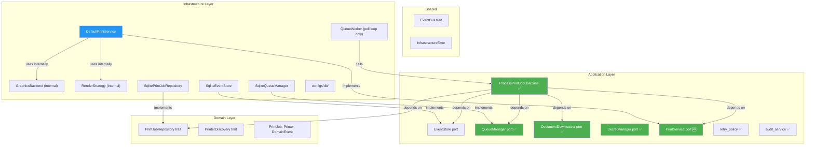

# Infrastructure Layer — Architecture Review

> [!NOTE]
> Review dựa trên source code tại `src-tauri/src/infrastructure/`. Đánh giá theo tiêu chuẩn **Clean Architecture** (Hexagonal / Ports & Adapters).

---

## 1. Cấu trúc hiện tại

```
infrastructure/
├── mod.rs                    # Module declarations
├── app_print_config.rs       # ⚠️ Loose file (JSON config read/write)
├── temp_file.rs              # ⚠️ Loose file (RAII temp PDF cleanup)
├── persistence/
│   ├── sqlite/               # DB adapters
│   │   ├── connection.rs     # 🟡 DbPool + WAL/busy_timeout config
│   │   ├── migrations.rs     # 🟡 Schema versioning (7 migrations)
│   │   ├── print_job_repository.rs  # PrintJobRepository impl
│   │   ├── event_store.rs    # EventStore impl (HMAC-signed)
│   │   └── audit.rs          # 🔴 Application-level audit functions
│   └── task_queue/           # "Durable queue" — nhưng chứa nhiều thứ khác
│       ├── queue_manager.rs  # 🔴 Trait + Error → nên ở application::ports
│       ├── sqlite_queue_manager.rs  # ✅ SQLite impl → đúng là persistence
│       ├── queue_worker.rs   # 🔴 Background orchestrator → KHÔNG phải persistence
│       └── retry_logic.rs    # 🔴 Business rules → KHÔNG phải persistence
├── platform/
│   ├── keychain/             # OS-native secret storage
│   │   ├── secret_manager.rs # SecretManager trait
│   │   ├── windows_credential_manager.rs
│   │   ├── macos_keychain.rs
│   │   └── linux_secret_service.rs
│   ├── printer_api/          # Platform printing
│   │   ├── backend.rs        # GraphicsBackend trait + Factory
│   │   ├── discovery.rs      # SystemPrinterDiscovery (PrinterDiscovery impl)
│   │   ├── windows.rs / macos.rs / linux.rs
│   └── updater/              # Auto-update checker
│       └── update_checker.rs
├── integrations/
│   ├── network/              # HTTP downloader
│   │   ├── document_downloader.rs  # DocumentDownloader trait
│   │   ├── reqwest_downloader.rs   # Reqwest impl
│   │   └── circuit_breaker.rs      # Circuit breaker pattern
│   └── pdf_engine/           # PDF rendering
│       ├── renderer.rs       # RenderStrategy trait
│       ├── bitmap_strategy.rs  # PDFium bitmap rendering
│       └── native_strategy.rs
├── bus/
│   └── event_bus/
│       └── tauri_event_bus.rs  # TauriEventBus (EventBus impl)
└── telemetry/
    └── metrics/
        └── collector.rs      # MetricsCollector
```

---

## 1.1 Phân tích: `connection.rs` & `migrations.rs` có nên tách ra `db/` không?

> [!IMPORTANT]
> **Có.** Đây là **database bootstrap** — không phải persistence logic. Chúng setup/configure database engine, không đọc/ghi domain data.

### Bản chất thực sự của từng file

| File | Trách nhiệm | Persistence? | Ai dùng? |
|---|---|---|---|
| `connection.rs` | Tạo connection, set WAL mode, busy_timeout, tạo `DbPool` | ❌ Database configuration | `main.rs`, `AppContext`, mọi repository |
| `migrations.rs` | Schema versioning (CREATE TABLE, ALTER TABLE, seed data) | ❌ Schema management | `main.rs`, `AppContext`, tests |
| `print_job_repository.rs` | CRUD cho `PrintJob` aggregate | ✅ Data persistence | Use cases, worker |
| `event_store.rs` | Lưu/đọc domain events + HMAC signing | ✅ Data persistence | Use cases, worker |

`connection.rs` và `migrations.rs` là **shared infrastructure** mà tất cả SQLite-based adapters đều phụ thuộc vào. Chúng tương đương "database configuration" — giống như `DatabaseAutoConfiguration` trong Spring Boot.

### Đề xuất tách → `infrastructure/configs/db/`

```
infrastructure/
├── configs/                    # 🆕 Configuration & bootstrap
│   └── db/
│       ├── connection.rs       # DbPool, WAL mode, busy_timeout
│       └── migrations.rs       # Schema versioning
├── persistence/                # Data adapters (chỉ CRUD)
│   ├── ...
```

Lý do chọn `configs/db/` thay vì `persistence/db/`:
- Connection setup + migrations phục vụ **toàn bộ infrastructure** (repos, event store, queue, metrics), không riêng persistence
- `configs/` có thể mở rộng: `configs/http/` (reqwest client config), `configs/app/` (print config) — tránh loose files
- Rõ ràng hơn về semantic: "đây là configuration, không phải data access"

---

## 1.2 Phân tích: `event_store`, `audit`, `task_queue` có thực sự thuộc persistence không?

> [!IMPORTANT]
> **Chỉ một phần.** Folder `task_queue/` đang gộp 4 concern khác nhau dưới tên "persistence", nhưng chỉ có `sqlite_queue_manager.rs` thực sự là persistence.

### Phân loại từng file

| File | Concern thực tế | Đúng ở persistence? | Nên ở đâu |
|---|---|---|---|
| **event_store.rs** | Lưu/đọc events vào SQLite | ✅ Đúng | Giữ nguyên `persistence/sqlite/` |
| **audit.rs** | `get_audit_trail()`, `verify_integrity()`, `cleanup_old_events()` — nhận `Arc<dyn EventStore>` | ❌ **Application logic** | `application::services::audit_service.rs` |
| **sqlite_queue_manager.rs** | SQL INSERT/UPDATE/SELECT trên `print_jobs` table | ✅ Đúng | Giữ nguyên `persistence/sqlite/` |
| **queue_manager.rs** (trait) | Port/contract: `push()`, `pop()`, `requeue()` | ❌ **Port definition** | `application::ports::queue_manager.rs` |
| **queue_worker.rs** | Background thread polling + job orchestration (download→render→print→complete) | ❌ **Runtime orchestration** | `infrastructure/worker/` |
| **retry_logic.rs** | `is_retryable()` phân loại error, `calculate_backoff_delay()` tính exponential backoff | ❌ **Application policy** | `application::services::retry_policy.rs` |

### Tại sao phân loại như vậy?

**`queue_worker.rs` — không phải persistence:**
```rust
// Nó làm orchestration, không phải data access:
job.queue()?;                    // domain state transition
downloader.download(...)?;       // network I/O
job.mark_downloaded()?;          // domain state transition
render_strategy.render(...);     // PDF rendering
backend.begin_document(...)?;    // printer API
job.complete()?;                 // domain state transition
persist_and_publish(...)?;       // event publishing
```
Đây là một **pipeline orchestrator** — tương đương use case. Phần duy nhất liên quan "queue" là poll loop (`queue_manager.pop()`) và retry (`queue_manager.requeue()`).

**`retry_logic.rs` — application policy (KHÔNG phải domain):**
```rust
// ⚠️ Depends on InfrastructureError (shared::errors) — domain KHÔNG nên biết
pub fn is_retryable(error: &InfrastructureError) -> bool {
    match error {
        InfrastructureError::NetworkError(_) => true,   // application decision
        InfrastructureError::ValidationError(_) => false, // application decision
    }
}
```
Trước đây tôi đề xuất đưa vào `domain::rules/` — **đó là SAI** vì function nhận `InfrastructureError` (shared layer). Domain layer không nên depend on shared errors. Đúng hơn là `application::services::retry_policy.rs`.

**`audit.rs` — application queries:**
```rust
pub fn get_audit_trail(
    store: &Arc<dyn EventStore>,  // ← nhận port, không nhận Connection
    aggregate_id: &str,
) -> Result<Vec<StoredEventData>, DomainError> {
    store.find_by_aggregate(aggregate_id)  // ← delegate to port
}
```
Nhận `Arc<dyn EventStore>` (application port) → không biết SQLite là gì → không phải SQLite-specific code → không thuộc `persistence/sqlite/`.

---

## 1.3 Đề xuất cấu trúc mới (v2 — đã sửa)

> [!IMPORTANT]
> Phiên bản trước có **3 sai lầm kiến trúc**. Dưới đây là bản sửa, với giải thích tại sao mỗi thay đổi.

### Sai lầm đã sửa

| # | Đề xuất cũ (SAI) | Đề xuất mới (ĐÚNG) | Lý do |
|---|---|---|---|
| 1 | `GraphicsBackend` → `application::ports` | Giữ ở **infrastructure** nội bộ, gộp vào `PrintService` port | `GraphicsBackend` quá low-level (`draw_bitmap`, `begin_page`, `HDC`) — application layer không nên biết |
| 2 | `RenderStrategy` → `application::ports` (riêng) | Gộp thành **`PrintService`** port duy nhất | Application chỉ cần "in file PDF này" — không cần biết bitmap vs native |
| 3 | `retry_logic.rs` → `domain::rules/` | → `application::services/` | `is_retryable()` nhận `InfrastructureError` — domain không nên depend on shared::errors |

### Dependency Rule verification

```
Domain ← Application ← Infrastructure ← Shared (cross-cutting)
(không depend gì)  (depend domain)   (depend app+domain)  (mọi layer đều dùng)
```

| Item di chuyển | From | To | Depends on | Hướng dependency | ✅/❌ |
|---|---|---|---|---|---|
| `QueueManager` trait | infra | `application::ports` | `domain::models::JobId`, `domain::models::PrintJob` | App → Domain | ✅ |
| `DocumentDownloader` trait | infra | `application::ports` | `domain::models::JobId`, `shared::errors` | App → Domain, App → Shared | ✅ |
| `SecretManager` trait | infra | `application::ports` | `shared::errors` | App → Shared | ✅ |
| `PrintService` trait (mới) | — | `application::ports` | `domain::models::PrintJobSettings`, `shared::errors` | App → Domain, App → Shared | ✅ |
| `retry_policy.rs` | infra | `application::services` | `shared::errors::InfrastructureError` | App → Shared | ✅ |
| `retry_policy.rs` | infra | ~~`domain::rules`~~ | ~~`shared::errors::InfrastructureError`~~ | ~~Domain → Shared~~ | ❌ vi phạm! |
| `audit.rs` | infra | `application::services` | `application::ports::EventStore` | App → App | ✅ |
| `GraphicsBackend` trait | infra | ~~`application::ports`~~ | `NativeGraphicsContext(HDC, CGContextRef)` | ~~App biết FFI details~~ | ❌ quá low-level |

### Cấu trúc đề xuất v2

```
infrastructure/
├── mod.rs
├── configs/                            # 🆕 Configuration & bootstrap
│   └── db/
│       ├── connection.rs               # DbPool, WAL, busy_timeout
│       └── migrations.rs               # Schema versioning
├── persistence/                        # Chỉ chứa data adapters
│   ├── sqlite_print_job_repository.rs  # PrintJobRepository impl
│   ├── sqlite_event_store.rs           # EventStore impl
│   └── sqlite_queue_manager.rs         # QueueManager impl
├── worker/                             # 🆕 Background processing
│   └── queue_worker.rs                 # Poll loop + thread lifecycle only
│                                       # (process_job extracted to use case)
├── printing/                           # 🆕 Gộp render + print internals
│   ├── print_service_impl.rs           # impl PrintService — wires backend+render
│   ├── backend.rs                      # GraphicsBackend trait (INTERNAL)
│   ├── backend_factory.rs              # Platform dispatch (#[cfg])
│   ├── windows.rs / macos.rs / linux.rs
│   ├── bitmap_strategy.rs              # BitmapRenderStrategy
│   └── native_strategy.rs             # NativePdfRenderStrategy
├── platform/
│   ├── keychain/                       # OS-native secret storage (giữ nguyên)
│   └── updater/                        # Auto-update (giữ nguyên)
├── integrations/
│   └── network/                        # HTTP downloader (giữ nguyên)
│       ├── reqwest_downloader.rs
│       └── circuit_breaker.rs
├── bus/                                # Event distribution (giữ nguyên)
│   └── event_bus/
└── telemetry/                          # Observability (giữ nguyên)
    └── metrics/

application/
├── ports/
│   ├── event_store.rs                  # (đã có)
│   ├── queue_manager.rs                # ← moved from task_queue
│   ├── document_downloader.rs          # ← moved from integrations/network
│   ├── secret_manager.rs               # ← moved from platform/keychain
│   └── print_service.rs               # 🆕 "In file PDF này vào printer X"
│                                       #    fn print(pdf, printer, settings) -> Result
├── services/
│   ├── audit_service.rs                # ← moved from persistence/sqlite/audit.rs
│   └── retry_policy.rs                # ← moved from task_queue/retry_logic.rs
│                                       #    (depends on shared::errors, NOT domain)
└── use_cases/
    └── process_print_job.rs            # ← extracted from queue_worker.process_job()
```

### Giải thích `PrintService` port

```rust
// application/ports/print_service.rs — Application chỉ biết interface này
pub trait PrintService: Send + Sync {
    /// In file PDF vào printer chỉ định.
    /// Application KHÔNG biết về HDC, bitmap, PDFium, CUPS.
    fn print(
        &self,
        pdf_path: &str,
        printer_name: &str,
        settings: &PrintJobSettings,
    ) -> Result<(), InfrastructureError>;
}

// infrastructure/printing/print_service_impl.rs — Infrastructure wires internals
pub struct DefaultPrintService {
    render_strategy: Arc<dyn RenderStrategy>,  // internal trait, KHÔNG public
}

impl PrintService for DefaultPrintService {
    fn print(&self, pdf_path: &str, printer_name: &str, settings: &PrintJobSettings)
        -> Result<(), InfrastructureError>
    {
        let mut backend = GraphicsBackendFactory::create();
        backend.begin_document(printer_name, "Sapo Print Job", None)?;
        self.render_strategy.render(pdf_path, settings, &mut *backend)?;
        backend.end_document();
        Ok(())
    }
}
```

So sánh trước/sau trong `ProcessPrintJobUseCase`:

```diff
// TRƯỚC: Use case biết về low-level graphics
-let mut backend = GraphicsBackendFactory::create();
-backend.begin_document(job.printer_name(), "Sapo Print Job", None)?;
-render_strategy.render(pdf_path, &job.settings, &mut *backend);
-backend.end_document();

// SAU: Use case chỉ gọi 1 method
+print_service.print(pdf_path, job.printer_name(), &job.settings)?;
```

→ Application layer không biết `GraphicsBackend`, `HDC`, `begin_page()`, `draw_bitmap()` tồn tại.

---

## 1.4 Deep-dive: `platform/`, `integrations/`, `bus/`, `telemetry/`

### 🔵 platform/keychain/ — ✅ Tốt nhất trong infrastructure

| Tiêu chí | Đánh giá |
|---|---|
| **Tổ chức** | ⭐⭐⭐⭐⭐ — Trait + 3 platform impls, conditional compilation chuẩn |
| **Error handling** | ⭐⭐⭐⭐⭐ — Typed errors (`SecretStoreError`, `SecretRetrieveError`, `SecretDeleteError`), `Ok(None)` cho key-not-found |
| **Thread safety** | ⭐⭐⭐⭐⭐ — `Send + Sync` bounds, OS-level atomicity documented |
| **Validation** | ⭐⭐⭐⭐ — `validate_key()`, `MAX_SECRET_SIZE` guard, namespace isolation |
| **Tests** | ⭐⭐⭐⭐ — Roundtrip, delete, namespace, idempotent delete |

**Một vấn đề nhỏ:** `SecretManager` trait nằm ở `infrastructure::platform::keychain` — nên di chuyển lên `application::ports` (đã nêu ở 3.1).

**Documentation đặc biệt tốt** — module-level doc comments cover thread safety semantics, concurrent access behavior, size limits per platform, và security considerations. Đây là mẫu nên follow cho các module khác.

---

### 🟡 platform/printer_api/ — Nhiều vấn đề ẩn

**Tổ chức tổng thể:**
```
printer_api/
├── backend.rs    # GraphicsBackend trait + GraphicsBackendFactory
├── discovery.rs  # SystemPrinterDiscovery (implements PrinterDiscovery)
├── windows.rs    # WindowsGraphicsBackend (170 lines — real GDI code)
├── macos.rs      # MacOsGraphicsBackend (140 lines — lp command wrapper)
└── linux.rs      # LinuxGraphicsBackend (133 lines — copy của macOS)
```

**Vấn đề 1 — Code duplication macOS/Linux:**

> [!WARNING]
> `macos.rs` và `linux.rs` gần như **giống nhau 95%**: cùng logic `lpoptions -p -l`, cùng `lp -d` command, cùng temp dir + PNG save + cleanup. Chỉ khác tên struct và prefix temp dir.

```rust
// macos.rs:52-81 vs linux.rs:52-81 — IDENTICAL logic
if let Ok(output) = Command::new("lpoptions")
    .arg("-p").arg(&self.printer_name).arg("-l").output() {
    // ... exact same DPI parsing logic
}

// macos.rs:90-107 vs linux.rs:89-100 — IDENTICAL draw_bitmap
if let Some(img) = image::RgbImage::from_raw(width, height, data.to_vec()) {
    let _ = img.save(&path);
    self.page_files.push(path);
}
```

→ Nên extract thành `CupsGraphicsBackend` chung cho cả macOS và Linux, hoặc dùng shared module.

**Vấn đề 2 — Không có `Drop` impl cho `WindowsGraphicsBackend`:**

```rust
pub struct WindowsGraphicsBackend {
    hdc: Option<HDC>,   // ← Windows device context, phải cleanup
}
// ❌ Không có impl Drop → nếu struct bị drop trước end_document() → HDC leak
```

`end_document()` gọi `DeleteDC(hdc)`, nhưng nếu xảy ra panic giữa `begin_document` và `end_document`, HDC sẽ bị leak. Cần impl `Drop` để đảm bảo RAII.

**Vấn đề 3 — `GraphicsBackendFactory` thiếu conditional compilation guard:**

```rust
// Compiles ALL platform modules unconditionally trên mod.rs:
pub mod windows;    // ← sẽ FAIL trên macOS/Linux
pub mod macos;      // ← sẽ FAIL trên Windows  
pub mod linux;      // ← sẽ FAIL trên Windows
```

`mod.rs` export tất cả 3 platform modules mà không có `#[cfg(target_os)]` → code chỉ compile trên platform có đủ dependencies. Nên thêm guards.

**Vấn đề 4 — `draw_bitmap` swallow errors:**

macOS/Linux backends: nếu `img.save()` fails → `let _ = img.save(&path)` → page bị mất âm thầm. Windows backend: nếu `StretchDIBits` fails → không kiểm tra return value.

---

### 🟡 integrations/network/ — Tốt, vài điểm nhỏ

| Tiêu chí | Đánh giá |
|---|---|
| **Tổ chức** | ⭐⭐⭐⭐⭐ — Trait + impl + resilience pattern, rõ ràng |
| **Error handling** | ⭐⭐⭐⭐⭐ — 4 error types phân loại rõ, cleanup trên mọi error path |
| **Resilience** | ⭐⭐⭐⭐⭐ — Circuit breaker FSM chuẩn, validation error undo |
| **Validation** | ⭐⭐⭐⭐⭐ — PDF header, URL scheme, max file size (100MB) |
| **Documentation** | ⭐⭐⭐⭐⭐ — README.md riêng, inline docs chi tiết |
| **Tests** | ⭐⭐⭐⭐ — 12 unit tests + integration test plan |

**Điểm mạnh đặc biệt:**
- `validate_url()` chặn `file://` và `data:` schemes → phòng SSRF
- Circuit breaker undo khi `ValidationError` (client-side issue, không phải server down)
- Atomic `.tmp` → `.pdf` rename — partial file không bao giờ lộ ra

**Vấn đề nhỏ — Hardcoded temp path:**
```rust
fn temp_file_path(job_id: &JobId, ext: &str) -> Result<PathBuf, InfrastructureError> {
    let home = home::home_dir()...;
    Ok(home.join(".sapo-printer").join("temp").join(...))  // ← hardcoded
}
```
Nên inject temp dir path qua constructor hoặc config để testable.

---

### 🔴 integrations/pdf_engine/ — Có vấn đề nghiêm trọng

| Tiêu chí | Đánh giá |
|---|---|
| **Tổ chức** | ⭐⭐⭐ — Trait + 2 strategies, đúng Strategy pattern |
| **Error handling** | ⭐ — **Silent failures**, errors swallowed |
| **Cross-module coupling** | ⭐⭐ — Depends directly on `platform::printer_api::backend` |
| **Tests** | ⭐ — **Không có tests** |

**Vấn đề 1 — CRITICAL: Silent error swallowing:**

```rust
// bitmap_strategy.rs — render() returns nothing!
impl RenderStrategy for BitmapRenderStrategy {
    fn render(&self, pdf_path: &str, settings: &PrintJobSettings,
              backend: &mut dyn GraphicsBackend) {
        // ← return type: ()  ← KHÔNG CÓ Result!
        
        let bind = Pdfium::bind_to_library(...)
        let pdfium = match bind {
            Err(e) => {
                eprintln!("Failed to load PDFium library: {:?}", e);
                return;   // ← SILENT RETURN — caller không biết render failed!
            }
        };
    }
}
```

`RenderStrategy::render()` trả về `()` → **caller (`QueueWorker`) không biết render thành công hay thất bại**. Job sẽ được mark `COMPLETED` dù thực tế trang trắng.

→ Trait nên trả `Result<(), RenderError>`.

**Vấn đề 2 — Cross-module coupling:**

```rust
// renderer.rs (integrations) imports từ platform:
use crate::infrastructure::platform::printer_api::backend::GraphicsBackend;
```

`integrations/pdf_engine` phụ thuộc trực tiếp vào `platform/printer_api`. Đây là **coupling ngang** giữa 2 sub-module infrastructure → không tốt. Nếu `GraphicsBackend` trait nằm ở `application::ports`, coupling này sẽ biến mất.

**Vấn đề 3 — `NativePdfRenderStrategy` chưa implement thực sự:**

```rust
NativeGraphicsContext::Windows(hdc) => {
    eprintln!("Native rendering to Windows HDC: {} ...", hdc);  // ← chỉ print
}
NativeGraphicsContext::Mac(cg_ctx) => {
    eprintln!("Native rendering to Mac CGContext: {}", cg_ctx);  // ← chỉ print
}
```

`native_strategy.rs` là placeholder — tất cả 3 platform branches chỉ `eprintln!()` rồi return, không render gì thực tế. Nên đánh dấu `#[deprecated]` hoặc `todo!()` rõ ràng.

**Vấn đề 4 — PDFium binding duplicated:**

```rust
// Cùng 1 đoạn code copy-paste giữa bitmap_strategy.rs:22-24 và native_strategy.rs:22-24
let bind = Pdfium::bind_to_library(Pdfium::pdfium_platform_library_name_at_path("./bin/"))
    .or_else(|_| Pdfium::bind_to_library(Pdfium::pdfium_platform_library_name_at_path("./")))
    .or_else(|_| Pdfium::bind_to_system_library());
```

→ Nên extract thành `fn load_pdfium() -> Result<Pdfium, PdfiumError>`.

---

### 🟡 bus/event_bus/ — Tốt, một vấn đề design

| Tiêu chí | Đánh giá |
|---|---|
| **Tổ chức** | ⭐⭐⭐⭐ — Trait ở shared, impl ở infrastructure |
| **Thread safety** | ⭐⭐⭐⭐ — `Mutex<HashMap>` + `Arc<dyn EventHandler>` |
| **Tests** | ⭐⭐⭐⭐ — Status mapping + progress mapping tests |

**Vấn đề — Hardcoded event-to-status mapping + UI concern leak:**

```rust
// tauri_event_bus.rs:58-68 — Infrastructure chứa UI knowledge
let tauri_event = match event_type {
    "PrintJobCreated" | "PrintJobQueued" | ... => "job_status_changed",
    _ => return Ok(()),  // ← silent drop cho unknown events
};

// Lines 85-90 — Infrastructure tạo UI payload
let ui_payload = serde_json::json!({
    "job_id": job_id,
    "status": status,
    "progress": progress,        // ← UI concern
    "error_message": error_message,
});
```

`TauriEventBus.publish()` vừa publish event, vừa **transform domain event thành UI payload** (tính progress %). Đây là **presentation logic** — nên tách thành separate handler hoặc middleware.

**Điểm tốt:** Handlers spawn trong `std::thread::spawn` → non-blocking. Lock được drop trước khi emit → tránh deadlock.

---

### 🟡 telemetry/metrics/ — Đặt đúng folder, sai abstraction

| Tiêu chí | Đánh giá |
|---|---|
| **Tổ chức** | ⭐⭐⭐ — Đúng folder telemetry, nhưng logic phức tạp |
| **Tests** | ⭐⭐⭐⭐⭐ — 8 tests bao gồm edge cases (empty DB, single value percentile) |
| **SQL quality** | ⭐⭐⭐⭐ — Correlated subqueries cho step duration, percentile calculation chính xác |

**Vấn đề đã nêu (3.6):** Bypass repository, dùng raw SQL. Thêm vào đó:

**`MetricsCollector` thực chất là application service:**
```rust
pub struct MetricsCollector {
    conn: Arc<Mutex<Connection>>,      // infrastructure dependency
    queue_manager: Arc<dyn QueueManager>,  // application dependency
}
```

Nó collect business metrics (success rate, printer utilization) → đây là **application-level analytics**, không phải infrastructure telemetry. So sánh:
- **Infrastructure telemetry:** CPU usage, memory, connection pool stats, latency histograms
- **Application metrics:** Job success rate, avg download time, printer utilization → business KPIs

→ Nên ở `application::services::metrics_service.rs`, inject `PrintJobRepository` thay vì raw `Connection`.

---

### Tổng kết đánh giá từng sub-module

| Module | Điểm | Vấn đề chính |
|---|---|---|
| `platform/keychain/` | ⭐⭐⭐⭐⭐ | Trait placement |
| `platform/printer_api/` | ⭐⭐⭐ | Code duplication macOS/Linux, no Drop, error swallowing |
| `platform/updater/` | ⭐⭐⭐⭐ | Tauri coupling (chấp nhận được cho infra) |
| `integrations/network/` | ⭐⭐⭐⭐⭐ | Hardcoded temp path (minor) |
| `integrations/pdf_engine/` | ⭐⭐ | **Silent failures, no tests, cross-coupling, placeholder code** |
| `bus/event_bus/` | ⭐⭐⭐⭐ | UI concern leak trong publish() |
| `telemetry/metrics/` | ⭐⭐⭐ | Bypass repository, nên là application service |

---

## 2. Điểm mạnh ✅

### 2.1 Phân loại module hợp lý
Cấu trúc **5 nhóm con** (`persistence`, `platform`, `integrations`, `bus`, `telemetry`) rất tốt, phân tách rõ ràng theo trách nhiệm:
- `persistence` = data storage (SQLite, queue)
- `platform` = OS-specific adapters (keychain, printer, updater)
- `integrations` = external services (HTTP, PDF engine)
- `bus` = event distribution
- `telemetry` = observability

### 2.2 Dependency Inversion đã áp dụng tốt ở nhiều chỗ
| Port (Trait) | Nơi khai báo | Adapter |
|---|---|---|
| `PrintJobRepository` | `domain::repository` | `SqlitePrintJobRepository` |
| `PrinterDiscovery` | `domain::repository` | `SystemPrinterDiscovery` |
| `EventStore` | `application::ports` | `SqliteEventStore` |
| `EventBus` | `shared::event_bus` | `TauriEventBus`, `InMemoryEventBus` |
| `SecretManager` | `infrastructure::platform::keychain` | `WindowsCredentialManager`, etc. |
| `DocumentDownloader` | `infrastructure::integrations::network` | `ReqwestDownloader` |
| `QueueManager` | `infrastructure::persistence::task_queue` | `SqliteQueueManager` |
| `RenderStrategy` | `infrastructure::integrations::pdf_engine` | `BitmapRenderStrategy` |
| `GraphicsBackend` | `infrastructure::platform::printer_api` | `WindowsGraphicsBackend`, etc. |

### 2.3 Patterns đáng chú ý
- **RAII cleanup** (`TempPdfFile`) — auto-delete temp files on drop
- **Outbox Pattern** (`persist_and_publish`) — events persisted before bus publish
- **Circuit Breaker** — bảo vệ downstream service
- **HMAC-signed events** — tamper detection cho audit trail
- **Atomic rename** `.tmp` → `.pdf` — download integrity
- **Platform conditional compilation** — `#[cfg(target_os)]` cho keychain + printer

### 2.4 Test coverage tốt
Hầu hết module đều có `#[cfg(test)] mod tests` với test cases có ý nghĩa. `SqliteQueueManager` có 8 tests, `MetricsCollector` có 8 tests, `retry_logic` có 10 tests.

---

## 3. Vấn đề kiến trúc ⚠️

### 3.1 CRITICAL: Trait đặt sai layer (vi phạm Dependency Rule)

> [!CAUTION]
> **5 traits** được khai báo **trong infrastructure** thay vì `application::ports` hoặc `domain::repository`. Đây là vi phạm nghiêm trọng nhất của Clean Architecture.

| Trait | Hiện tại | Nên ở |
|---|---|---|
| `QueueManager` | `infrastructure::persistence::task_queue` | `application::ports` |
| `DocumentDownloader` | `infrastructure::integrations::network` | `application::ports` |
| `RenderStrategy` | `infrastructure::integrations::pdf_engine` | `application::ports` |
| `GraphicsBackend` | `infrastructure::platform::printer_api` | `application::ports` |
| `SecretManager` | `infrastructure::platform::keychain` | `application::ports` |

**Hệ quả thực tế — dependency ngược:**
```rust
// application/handlers/push_to_queue_handler.rs — PHẢI import infrastructure
use crate::infrastructure::persistence::task_queue::QueueManager;  // ← vi phạm!

// application/use_cases/get_metrics.rs — test PHẢI import infrastructure
use crate::infrastructure::persistence::task_queue::{QueueError, QueueManager};  // ← vi phạm!
```
Application layer import infrastructure → dependency hướng ra ngoài → phá vỡ Dependency Rule.

### 3.2 HIGH: `QueueWorker` chứa application logic VÀ đặt sai folder

```
queue_worker.rs (547 lines) — đang ở infrastructure/persistence/task_queue/
                                         ^^^^^^^^^^^
                                         Không phải persistence!
```

**Hai vấn đề chồng nhau:**

1. **Sai folder:** `queue_worker.rs` nằm trong `persistence/task_queue/` nhưng nó không persist gì cả. Nó poll queue, download files, render PDF, gửi tới printer. Đây là **runtime/background processing**, không phải data access.

2. **Sai layer:** `QueueWorker.process_job()` thực hiện toàn bộ **orchestration logic**:
   - Transition states: `queue()` → `mark_downloaded()` → `mark_submitted()` → `mark_printing()` → `complete()`
   - Event drain → persist → publish (Outbox Pattern)
   - Retry decision + requeue

**Tách thành:**

| Phần | Layer | Folder |
|---|---|---|
| Poll loop + thread lifecycle (`start/stop/process_loop`) | Infrastructure | `infrastructure/runtime/queue_worker.rs` |
| Job processing pipeline (`process_job`) | Application | `application/use_cases/process_print_job.rs` |
| `persist_and_publish` | Application | `application/services/outbox_publisher.rs` |
| `handle_job_failure` + retry decision | Application | `application/services/job_failure_handler.rs` |

### 3.3 HIGH: `audit.rs` và `retry_logic.rs` nằm sai chỗ

**audit.rs** — nằm trong `persistence/sqlite/` nhưng không dùng SQLite:
```rust
// Signature: nhận Arc<dyn EventStore> — không biết SQLite là gì
pub fn get_audit_trail(
    store: &Arc<dyn EventStore>,  // ← application port
    aggregate_id: &str,
) -> Result<Vec<StoredEventData>, DomainError> { ... }
```
Đây là application service, nên ở `application::services::audit_service.rs`.

**retry_logic.rs** — nằm trong `persistence/task_queue/` nhưng là business rules:
```rust
// Business decision: loại lỗi nào được retry?
pub fn is_retryable(error: &InfrastructureError) -> bool { ... }
// Business policy: retry bao lâu?
pub fn calculate_backoff_delay(retry_count: u32) -> u64 { ... }
```
Đây là **domain policy**, nên ở `domain::rules::retry_policy.rs`.

### 3.4 MEDIUM: 2 file "loose" ở root infrastructure

| File | Vấn đề | Đề xuất |
|---|---|---|
| `app_print_config.rs` | Free functions (`save_config`/`load_config`), hardcode path, không có trait | Di chuyển vào `persistence/config/` hoặc tạo `ConfigStore` trait |
| `temp_file.rs` | Cross-cutting concern, được dùng bởi `queue_worker` | Di chuyển vào `shared::utils` hoặc `persistence/temp/` |

### 3.5 MEDIUM: `SqliteEventStore` có dual interface

```rust
// Inherent methods (public):
impl SqliteEventStore {
    pub fn save_all(...)       // ← trùng signature
    pub fn save_event(...)     // ← không có trong EventStore trait  
    pub fn find_by_aggregate(...)
    pub fn get_or_create_signing_key(...)
    pub fn delete_events_before(...)
}

// Port impl (delegates to inherent):
impl EventStore for SqliteEventStore {
    fn save_all(...)           // → self.save_all()
    fn find_by_aggregate(...)  // → self.find_by_aggregate() + mapping
    fn delete_events_before(...)
}
```

- `save_event()` là public nhưng không nằm trong `EventStore` trait → inconsistent API surface
- `get_or_create_signing_key()` là public infrastructure detail, lộ ra ngoài
- `find_by_aggregate` trả về `StoredEvent` (infra) nhưng trait trả về `StoredEventData` (port) → phải map → data duplication

### 3.6 MEDIUM: `MetricsCollector` bypass repository layer

```rust
// collector.rs — trực tiếp query SQL thay vì đi qua repository
pub struct MetricsCollector {
    conn: Arc<Mutex<Connection>>,   // ← raw DB connection
    queue_manager: Arc<dyn QueueManager>,
}
```

`MetricsCollector` dùng raw SQL queries trực tiếp (`SELECT status, COUNT(*) FROM print_jobs GROUP BY status`) thay vì đi qua `PrintJobRepository`. Điều này:
- Bypass domain validation
- Duplicate schema knowledge (column names, status strings)
- Không testable nếu không có real SQLite

### 3.7 LOW: Status string mismatch giữa modules

```rust
// print_job_repository.rs — uses UPPER_CASE
fn status_to_string(s: &PrintStatus) -> String {
    PrintStatus::Pending => "PENDING"
}

// sqlite_queue_manager.rs — uses PascalCase  
"WHERE status = 'Queued'"
"SET status = 'Queued'"
"SET status = 'Pending'"
```

> [!WARNING]
> `SqlitePrintJobRepository` lưu status dạng `PENDING`, `QUEUED` nhưng `SqliteQueueManager` lưu dạng `Pending`, `Queued`. Nếu cả hai chạy trên cùng DB → **query sẽ không match**, dẫn đến jobs bị "kẹt" trong queue.

### 3.8 LOW: Single `Arc<Mutex<Connection>>` — performance bottleneck

```rust
// connection.rs
pub struct DbPool(Arc<Mutex<Connection>>);  // ← chỉ 1 connection
```

Mọi operation (repo, event store, queue, metrics) đều lock cùng 1 connection. Với workload cao:
- `MetricsCollector` giữ lock lâu (nhiều queries) → block `QueueWorker` pop()
- Đã có mitigations (busy_timeout 30s, collect queue_depth trước lock) nhưng chưa triệt để

### 3.9 LOW: `TauriEventBus` coupling với Tauri API

`TauriEventBus` import `tauri::{AppHandle, Emitter}` — điều này đúng cho infra layer, nhưng `update_checker.rs` cũng import `AppHandle` trực tiếp. Nên cân nhắc wrap `AppHandle` trong một adapter nếu cần decouple khỏi Tauri runtime.

---

## 4. Dependency Flow Analysis

```mermaid
graph TD
    subgraph "Domain Layer"
        D_Repo["PrintJobRepository trait"]
        D_Discovery["PrinterDiscovery trait"]
        D_Models["PrintJob, Printer, DomainEvent"]
    end

    subgraph "Application Layer"
        A_EventStore["EventStore port"]
        A_UseCases["Use Cases"]
    end

    subgraph "Shared"
        S_EventBus["EventBus trait"]
        S_Errors["InfrastructureError"]
        S_AppCtx["AppContext"]
    end

    subgraph "Infrastructure Layer"
        I_QM["QueueManager trait ⚠️"]
        I_DL["DocumentDownloader trait ⚠️"]
        I_RS["RenderStrategy trait ⚠️"]
        I_GB["GraphicsBackend trait ⚠️"]
        I_SM["SecretManager trait ⚠️"]
        I_Worker["QueueWorker ⚠️"]
        I_SqlRepo["SqlitePrintJobRepository"]
        I_SqlES["SqliteEventStore"]
        I_SqlQM["SqliteQueueManager"]
        I_Metrics["MetricsCollector"]
    end

    I_SqlRepo -->|implements| D_Repo
    I_SqlES -->|implements| A_EventStore
    I_SqlQM -->|implements| I_QM
    I_Worker -->|depends on| I_QM
    I_Worker -->|depends on| I_DL
    I_Worker -->|depends on| I_RS
    I_Worker -->|depends on| D_Repo
    I_Worker -->|depends on| A_EventStore
    I_Worker -->|depends on| S_EventBus
    I_Metrics -->|depends on| I_QM
    S_AppCtx -->|depends on| I_SM

    style I_QM fill:#ff9800,color:#000
    style I_DL fill:#ff9800,color:#000
    style I_RS fill:#ff9800,color:#000
    style I_GB fill:#ff9800,color:#000
    style I_SM fill:#ff9800,color:#000
    style I_Worker fill:#ff9800,color:#000
```



> Các node **màu cam** là vi phạm Dependency Rule — trait hoặc logic đặt sai layer.

**Sau refactor v2** — dependency diagram mới:



> Các node **xanh lá** là ports/use cases đã đúng layer. Node **xanh dương** là infrastructure adapter mới.
> `GraphicsBackend` + `RenderStrategy` giờ là **internal** implementation details — application không nhìn thấy.

---

## 5. Kế hoạch refactor (ưu tiên theo impact)

### Phase 1 — Critical Fixes (Data Integrity + Silent Failures)

| # | Action | Risk |
|---|---|---|
| 1 | **Fix status string mismatch** `SqliteQueueManager`: đổi `'Pending'`→`'PENDING'`, `'Queued'`→`'QUEUED'`, `'Failed'`→`'FAILED'` | 🔴 Data bug, jobs sẽ kẹt |
| 2 | Tạo shared `fn status_to_db_string()` dùng chung cho cả repo và queue manager | 🟡 |
| 3 | **Đổi `RenderStrategy::render()` trả `Result<(), RenderError>`** — hiện tại trả `()` → silent failures → jobs completed dù trang trắng | 🔴 Silent data corruption |
| 4 | Thêm `impl Drop for WindowsGraphicsBackend` — gọi `DeleteDC` để tránh HDC leak khi panic | 🟡 Resource leak |

### Phase 2 — Port Extraction + PrintService (DI Compliance)

| # | Action | Impact |
|---|---|---|
| 5 | Di chuyển `QueueManager` trait → `application::ports::queue_manager.rs` | High |
| 6 | Di chuyển `DocumentDownloader` trait → `application::ports::document_downloader.rs` | High |
| 7 | Di chuyển `SecretManager` trait → `application::ports::secret_manager.rs` | Medium |
| 8 | Tạo `PrintService` port (`application::ports::print_service.rs`) — gộp render + print | High |
| 9 | Tạo `DefaultPrintService` (`infrastructure/printing/`) — impl wires backend + render strategy | High |

> **Lưu ý:** `GraphicsBackend` và `RenderStrategy` **KHÔNG** di chuyển lên application. Chúng ở lại infrastructure như internal details, ẩn sau `PrintService` port.

### Phase 3 — Logic Relocation + Code Quality

| # | Action | Impact |
|---|---|---|
| 10 | Tách `QueueWorker.process_job()` → `ProcessPrintJobUseCase` (inject `PrintService` thay vì `RenderStrategy` + `GraphicsBackend`) | High |
| 11 | Di chuyển `retry_logic.rs` → `application::services::retry_policy.rs` (depends on `shared::errors`, NOT domain) | Medium |
| 12 | Di chuyển `audit.rs` functions → `application::services::audit_service.rs` | Medium |
| 13 | Gộp `macos.rs` + `linux.rs` → `CupsGraphicsBackend` (xoá ~130 dòng duplicate) | Medium |
| 14 | Extract `fn load_pdfium()` chung cho bitmap + native strategy | Low |
| 15 | Tách presentation logic (`status_to_progress`) ra khỏi `TauriEventBus.publish()` | Low |
| 16 | Di chuyển `app_print_config.rs` → `configs/app/` + tạo trait | Low |
| 17 | Di chuyển `temp_file.rs` → `shared::utils::temp_file.rs` | Low |

### Phase 4 — Folder Restructure + Performance

| # | Action | Impact |
|---|---|---|
| 18 | Tách `connection.rs` + `migrations.rs` → `infrastructure/configs/db/` | Medium |
| 19 | Di chuyển `MetricsCollector` → `application::services::metrics_service.rs`, inject repository | Medium |
| 20 | Thêm `#[cfg(target_os)]` guards cho `printing/mod.rs` (platform modules) | Low |
| 21 | Cân nhắc connection pool (r2d2-sqlite) thay thế single `Arc<Mutex<Connection>>` | Low |
| 22 | Loại bỏ `SqliteEventStore` public inherent methods, chỉ expose qua trait | Low |
| 23 | Inject temp dir path vào `ReqwestDownloader` constructor thay vì hardcode | Low |

---

## 6. Đánh giá tổng thể

| Tiêu chí | Điểm | Ghi chú |
|---|---|---|
| **Module Organization** | ⭐⭐⭐⭐ | 5 nhóm rõ ràng, naming tốt; `connection.rs` và `task_queue/` cần tái tổ chức |
| **Dependency Inversion** | ⭐⭐⭐ | Đã tốt cho 3 traits (`PrintJobRepository`, `EventStore`, `EventBus`); còn 3 traits + render/print cần refactor |
| **Separation of Concerns** | ⭐⭐⭐ | `QueueWorker`, `audit.rs`, `MetricsCollector` chứa application logic; `TauriEventBus` chứa UI logic |
| **Data Consistency** | ⭐⭐ | Status string mismatch giữa 2 module quan trọng nhất |
| **Error Handling** | ⭐⭐⭐ | `keychain` + `network` xuất sắc; `pdf_engine` + `printer_api` nuốt lỗi âm thầm |
| **Testability** | ⭐⭐⭐⭐ | Hầu hết testable; `pdf_engine` không có test, `MetricsCollector` cần real SQLite |
| **Code Reuse** | ⭐⭐⭐ | `macos.rs`/`linux.rs` duplicate 95%; PDFium binding copy-paste |
| **Platform Support** | ⭐⭐⭐⭐⭐ | Windows/macOS/Linux qua conditional compilation + CUPS fallback |

> **Overall: 3/5** — Module organization tốt, keychain + network là reference implementations. Nhưng pdf_engine silent failures, status mismatch, và missing ports cần giải quyết trước khi scale. **Top 3 ưu tiên:** (1) Fix RenderStrategy trả Result, (2) Fix status string mismatch, (3) Tạo PrintService port + di chuyển traits.

